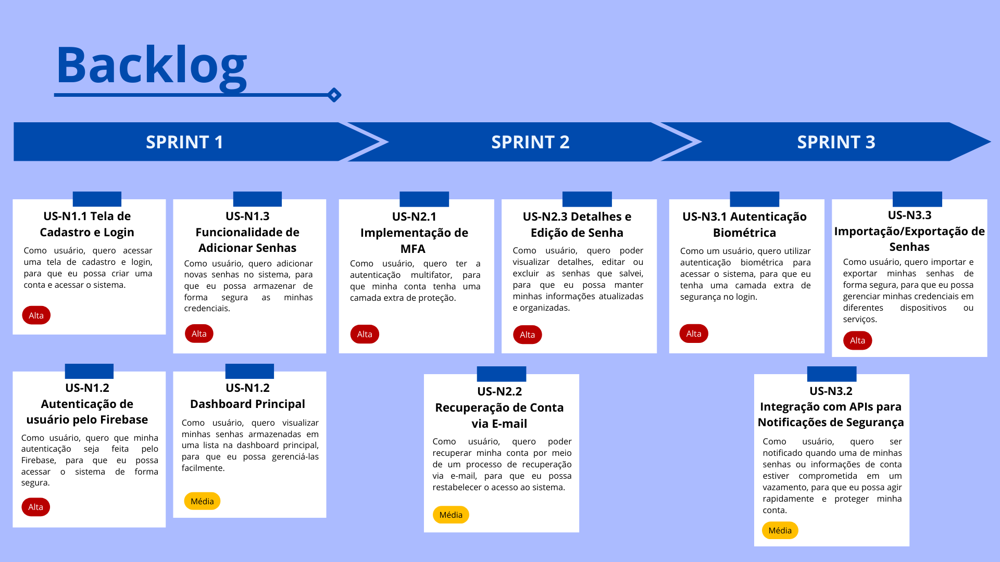
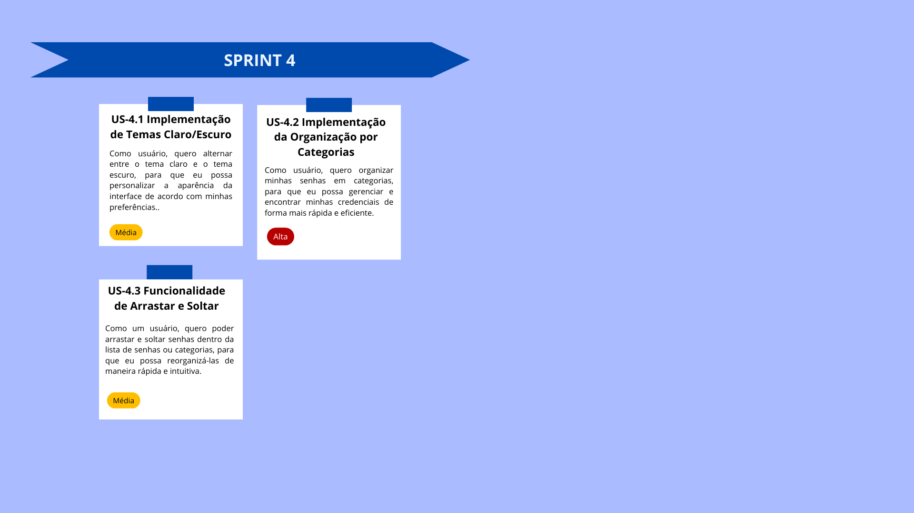

<h1 align='center'>
  Gerenciador de Senhas
</h1>

<h2 align='center'>
  Trabalho Semestral APP Mobile - 4º SEM DSM - 2024
</h2>

   
   

 
  :closed_lock_with_key: Proteção | :wrench: Funcionalidades | :iphone: Mobilidade

---

## :dart: Objetivo

O objetivo deste aplicativo é fornecer uma solução segura, eficiente e intuitiva para o armazenamento e gerenciamento de senhas. Ele garante a proteção das informações de login através de criptografia de ponta a ponta, além de oferecer ferramentas como geração de senhas fortes, autenticação multifator (MFA) e monitoramento de vazamentos. O aplicativo facilita a organização das senhas por categorias, permitindo a importação e exportação segura de dados. Ele também assegura a compatibilidade multiplataforma, oferecendo acesso sincronizado em diversos dispositivos. Com funcionalidades de recuperação de conta e notificações de segurança, o aplicativo visa maximizar a proteção e a usabilidade, ajudando os usuários a manterem suas informações sempre seguras e organizadas.

---

## :bookmark_tabs: Índice

- [Objetivo](#dart-objetivo)
- [Relatórios da Sprint](#relatorios)
- [Requisitos Funcionais](#funcionais)
- [Requisitos Não Funcionais](#nao-funcionais)
- [Backlog](#backlog)

---

## :pushpin: Relatórios da Sprint

| Sprint |  Entrega   |            Status           | 
|:------:|:----------:|:---------------------------:|
| 01     | 04/10/2024 | ✔️ Finalizada | 
| 02     | 25/10/2024 | :hourglass_flowing_sand: 🚀 Iniciada | 
| 03     | 18/11/2024 | :hourglass_flowing_sand: Não iniciada | 
| 04     | 06/12/2024 | :hourglass_flowing_sand: Não iniciada | 

→ [Voltar ao topo](#topo)

---

## :clipboard: Requisitos Funcionais

- :lock: **Cadastro e Login**
- :key: **Autenticação via Firebase**
- :gear: **Criação de Senhas Fortes**
- :shield: **Autenticação Multifator (MFA)**
- :mailbox: **Recuperação de Conta**
- :heavy_plus_sign: **Adicionar Senhas**
- :eyes: **Visualização de Senhas**
- ⚡**Verificador de força da senha**
- :pencil2: **Edição e Exclusão de Senhas**
- :inbox_tray: **Importação/Exportação de Senhas**
- :closed_lock_with_key: **Autenticação Biométrica**
- :warning: **Monitoramento de Vazamentos de Dados**
- :file_folder: **Organização por Categorias**
- :arrows_counterclockwise: **Funcionalidade de Arrastar e Soltar**
- :sunny: **Troca de Tema Claro/Escuro**

→ [Voltar ao topo](#topo)

---

## :clipboard: Requisitos Não Funcionais

- :chart_with_upwards_trend: **Escalabilidade**: A arquitetura do sistema deve ser escalável para suportar o crescimento.
- :mag: **Usabilidade**: A interface deve ser intuitiva, com foco na experiência do usuário.
- :desktop_computer: **Compatibilidade**: O sistema deve funcionar em navegadores modernos e dispositivos móveis.
- :zap: **Performance**: A troca de tema claro/escuro deve ocorrer instantaneamente, sem recarregar a página.
- :lock_with_ink_pen: **Segurança dos Dados**: Garantir que os dados exportados estejam protegidos por criptografia de ponta a ponta.
- :lock: **Proteção de Senhas**: As senhas devem ser criptografadas antes de serem enviadas ao servidor.

→ [Voltar ao topo](#topo)

---

## :clipboard: Backlog Total

→ [Voltar ao topo](#topo)

---
